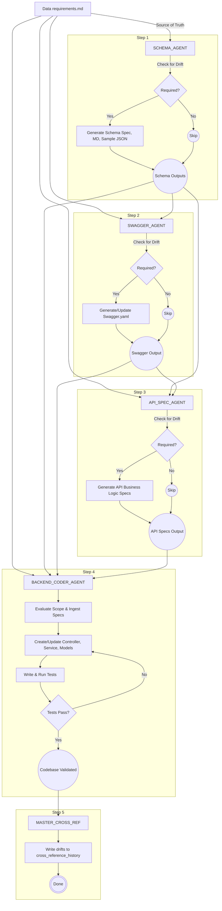

# Agentic Architecture Flow

This flowchart illustrates the end-to-end orchestration pipeline managed by the `MASTER_BACKEND_AGENT` and its specialized sub-agents.

```mermaid
flowchart TD
    Req[Data requirements.md] -->|Source of Truth| SA

    subgraph Step 1
    SA[SCHEMA_AGENT]
    SA -->|Check for Drift| SA_Cond{Required?}
    SA_Cond -- Yes --> SA_Gen[Generate Schema Spec, MD, Sample JSON]
    SA_Cond -- No --> SA_Skip((Skip))
    SA_Gen --> SA_Out((Schema Outputs))
    SA_Skip --> SA_Out
    end

    Req --> SWA
    SA_Out --> SWA

    subgraph Step 2
    SWA[SWAGGER_AGENT]
    SWA -->|Check for Drift| SWA_Cond{Required?}
    SWA_Cond -- Yes --> SWA_Gen[Generate/Update Swagger.yaml]
    SWA_Cond -- No --> SWA_Skip((Skip))
    SWA_Gen --> SWA_Out((Swagger Output))
    SWA_Skip --> SWA_Out
    end

    Req --> ASA
    SA_Out --> ASA
    SWA_Out --> ASA

    subgraph Step 3
    ASA[API_SPEC_AGENT]
    ASA -->|Check for Drift| ASA_Cond{Required?}
    ASA_Cond -- Yes --> ASA_Gen[Generate API Business Logic Specs]
    ASA_Cond -- No --> ASA_Skip((Skip))
    ASA_Gen --> ASA_Out((API Specs Output))
    ASA_Skip --> ASA_Out
    end

    Req --> BCA
    SA_Out --> BCA
    SWA_Out --> BCA
    ASA_Out --> BCA

    subgraph Step 4
    BCA[BACKEND_CODER_AGENT]
    BCA --> BCA_Eval[Evaluate Scope & Ingest Specs]
    BCA_Eval --> BCA_Code[Create/Update Controller, Service, Models]
    BCA_Code --> BCA_Test[Write & Run Tests]
    BCA_Test --> BCA_Pass{Tests Pass?}
    BCA_Pass -- No --> BCA_Code
    BCA_Pass -- Yes --> BCA_Out((Codebase Validated))
    end

    BCA_Out --> MCR

    subgraph Step 5
    MCR[MASTER_CROSS_REF]
    MCR --> MCR_Write[Write drifts to cross_reference_history]
    MCR_Write --> Done(((Done)))
    end
```
